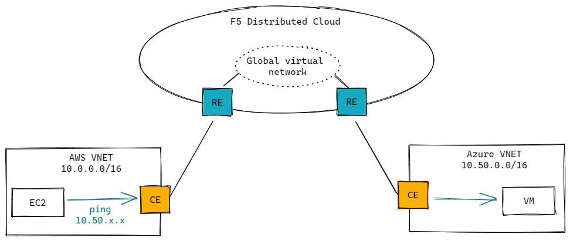

# F5 Distributed Cloud - L3 network stitching

This Terraform project provisions the infrastructure in Azure and AWS, then connects the two L3 domain with [Global Virtual Network](https://docs.cloud.f5.com/docs/ves-concepts/networking) feature in F5 Distributed Cloud.

